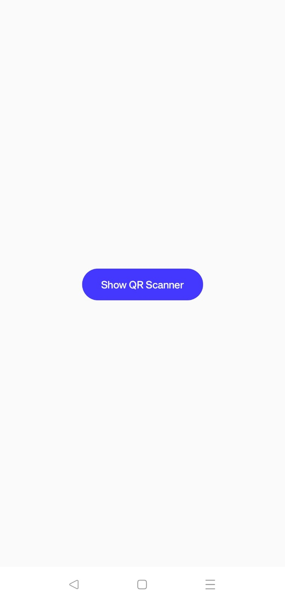
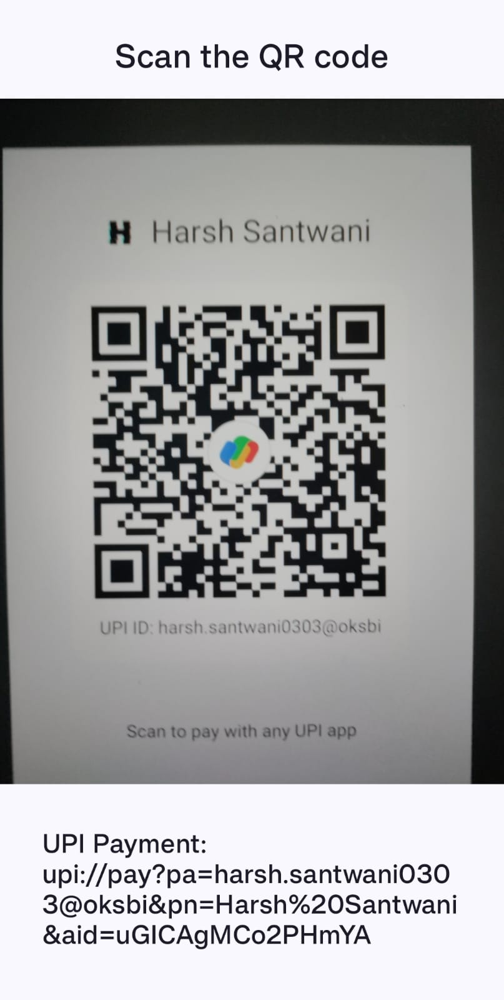

# QR Code Scanner 

QR Code Scanner is a simple and efficient Android application for scanning QR codes. It is built using Kotlin and Jetpack Compose, leveraging CameraX for real-time QR code scanning.

## Features

- **Real-time QR Code Scanning**: Quickly scans and processes QR codes using CameraX.
- **UPI Payment Handling**: Detects UPI payment QR codes and prompts for payment through the appropriate app.
- **URL Handling**: Opens scanned URLs in the default web browser.
- **Plain Text Handling**: Displays scanned text directly within the app.

## Installation

1. Clone the repository:
    ```sh
    git clone https://github.com/HydrallHarsh/QR-Code-Scanner-Prodigy.git
    ```
2. Open the project in Android Studio.
3. Build and run the application on your Android device.

## Usage

1. Launch the QR Code Scanner app.
2. Grant camera permission when prompted.
3. Point the camera at a QR code to scan it.
4. The app will automatically detect the QR code and perform the appropriate action based on its content.

## Dependencies

- [CameraX](https://developer.android.com/training/camerax): Used for camera functionality.
- [Jetpack Compose](https://developer.android.com/jetpack/compose): Used for building the UI.

## Code Structure

- **MainActivity.kt**: The main activity that hosts the camera preview and handles QR code scanning.
- **QrCodeAnalyser.kt**: The QR code analyzer that processes the camera frames and detects QR codes.
- **ui/theme**: Contains the theming files for the app.

## Screenshots




## Contributing

Contributions are welcome! Please open an issue or submit a pull request for any enhancements or bug fixes.

## Contact

Harsh Santwani - [Your Email](harsh.santwani0303@gmail.com)

Project Link: [https://github.com/HydrallHarsh/QR-Code-Scanner-Prodigy](https://github.com/HydrallHarsh/QR-Code-Scanner-Prodigy)
